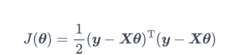

#  linear regression

##  Introduction
对于线性回归问题，我们假设输入与输出成线性关系。那么该线性映射关系可以写为：

其中theta是模型的参数，x是输入的数据，在几何中可以得出该函数为d维的平面，如果函数含有常数项时只需要再添加一维参数以及对应的x = 1。通常在机器学习中，我们一般先设计损失函数，损失函数统计预测值与实际值的差距,并通过最小化损失函数来训练模型，调整模型参数theta。假设输入的数据为x1、x2......xn,其对应的标签为y1、y2......yn，那么模型的总损失为：

并且我们定义损失函数为平方损失：

将该损失函数代入总误差可得：

这一总损失函数称为均方误差，是最常用的损失函数之一。我们的目的是预测的标签与实际的标签越接近越好，因此误差就越小越好，故线性回归问题的优化目标为：

## Analytical Methods for Linear Regression
为了使简化表达式、方便计算，我们把输入的数据和标签组成矩阵的形式，这样，以向量的平方作为损失函数，可将总损失写为：

为了寻找总损失函数的最小值，我们寻找其对theta导数为零的点，于是，算法学到的模型对训练数据的预测为：

##  Practice_1
书中给出的实践例子是根据某一区域中房屋的整体信息，用线性模型预测该区域中房屋的平均售价。数据集由房屋信息与房屋售价组成。其中，房屋信息包含所在区域平均收入、区域平均房屋年龄、区域平均房间数、区域平均卧室数、人口等。

首先我们需要读入并处理数据，然后再划分训练集和测试集。对于处理数据，我们需要将数据标准化，数据标准化有着非常重要的作用，试想一下我们的平均卧室的数量一般就在3-5之间，但是区域平均收入却能达到几万，二者的数量级相差巨大，在训练时会产生负面影响。于是，通常我们我们会用到 sklearn 中的数据处理工具包`preprocessing`中的`StandardScalar`类。该类的`fit`函数可以根据输入的数据计算平均值和方差，并用计算结果将数据标准化将不同特征的数据放缩到同一量级上。

再完成以上的步骤后，我们就按照之前描述的原理进行实验，我们利用 NumPy 库中的工具直接进行矩阵运算，并输出预测值与真实值的误差。这里我们采用均方根误差RMSE，实验的结果见下图:

##  Gradient Descent Algorithm
将损失函数映射到几何空间中，一般为三维的网，我们的目标是找到函数值最小时的参数theta，在三维空间中找取最小值，我们很容易的就可以想到梯度，梯度的方向就是函数值上升最快的方向。那么反过来说，梯度的反方向就是函数值下降最快的方向。于是我们可以不断将参数沿梯度的反方向调整，就可以使函数值以最快的速度减小。就是走一步计算一步，直到到达最底部。而当函数值几乎不再改变时，我们就找到了函数的一个局部极小值。而对于部分较为特殊的函数，其局部极小值就是其全局最小值。在此情况下，梯度下降算法最后可以得到全局最优解。

梯度下降的公式为：  

η是参数更新的步长，称为学习率，上节推导的带平均的线性回归损失函数代入进去，并写成矩阵形式就可以得到：

对于损失函数梯度下降的迭代过程，如果损失函数关于参数是凸函数，无论起点如何，沿梯度方向都可以到达是损失函数最小的地方。但是如果损失函数是非凸函数，那么梯度下降就可能陷入局部极小值，无法达到全局最优。

梯度下降的公式已经不含有矩阵求逆和矩阵相乘等时间复杂度很高的运算，但当样本量很大时，计算矩阵与向量相乘仍然很耗时，矩阵的存储问题也没有解决。因此，我们可以每次只随机选一个样本计算其梯度，并进行梯度下降。设选取的样本为，其参数更新可以写为：

这样的算法称为随机梯度下降法，除此之外为了在稳定性与时间复杂度之间取得平衡，我们一般使用小批量梯度下降算法，将样本随机分成许多大小较小的批量。每次迭代时，选取一个批量来计算函数梯度，以此估计用完整样本计算的结果。

下面是用SGD 算法完成相同的线性回归任务，并观察 SGD 算法的表现。首先，我们实现随机划分数据集和产生批量的函数。然后实现算法的主体部分。我们提前设置好迭代次数、学习率和批量大小，并用上面的公式不断迭代，最后将迭代过程中 RMSE 的变化曲线绘制出来。下面是实验结果：

可以看出，最终得到的结果和上面精确计算的结果已经十分接近，RMSE 也在可以接受的范围内。

##  Learning Rate
在梯度下降算法中，学习率是一个非常关键的参数。我们调整上面设置的学习率，观察训练结果的变化。

随着学习率的增大，收敛的速度不断增快，但是当学习率增大到1.5的时候却出现了发散的情况，因此，梯度下降算法的学习率往往需要多次调整，才能找到合适的值。

##  Conclusion
线性回归是机器学习中最基础的参数化学习模型，线性回归任务是机器学习中最基础的有监督学习任务。在学习了算法后还结合了预测房屋价格的例子，完成了算法的实践。

解析方法与梯度下降方法各有优劣。解析方法能够直接获得精确的解，但是其不足是计算的花销较大，对表达式的计算也十分困难。梯度下降的方法用较小的时空复杂度获得了与精确解较为接近的结果，但是需要人为的调整学习率等，综合而言梯度下降的方法更广为所用，是现代深度学习的基础之一。

