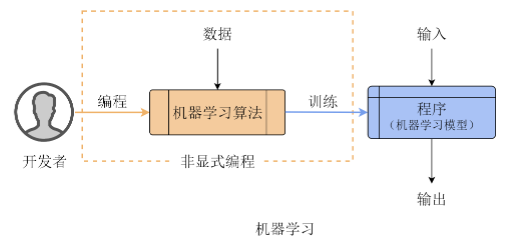
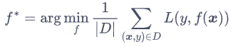
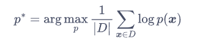

#  Exploring Machine Learning

##  Introduction
机器学习是机器通过经验数据，通过不断训练，以及对任务目标做出优化的自动化过程，例如人脸识别、语音识别等。机器学习是由编程人员编写机器学习算法，在不同任务下，通过关于任务的大量的数据训练，训练得到可以解决任务的程序，如下图:

##  Classification
机器学习按照任务可以分为三大类即有监督学习、无监督学习、强化学习。对于有监督学习，我们需要向机器提供数据以及对应的标签，模型的任务是根据数据预测其标签，其性能指标可以由损失函数L(y,f(x))来衡量。有监督学习的一般形式可以写为：

对于无监督学习，我们不需要提供数据的标签y，也就是训练集D的每一个数据实例仅由数据特征x来表示。我们通常用概率分布模型来建模数据的分布，无监督学习的一般形式可以写为：

有监督学习和无监督学习的最大区别在于，有监督模型最关注的是关于以数据为基础所预测出的标签是否准确，不关心数据之间的相关性，而无监督学习则与其相反，关注数据的分布与其中包含的模式，如关注人脸图像的概率分布。

强化学习则与上述两种学习截然不同，有监督学习和无监督学习关注于人工智能中的预测问题，强化学习关注人工智能中的决策问题。强化学习是寻找更好的决策策略的过程，而优化的目标则是策略决策带来的累积回报的期望。

按照建模方式来分类，机器学习模型可以分为参数化模型和非参数化模型两大类：
 1. 参数化模型：在一套具体的模型族内，每一个具体的模型都可以用一个具体的参数向量来唯一确定，因此确定了参数向量也就确定了模型。
 2. 非参数化模型：与参数化模型相反，非参数化模型并非由一个具体的参数向量来确定，其训练的算法也不是更新模型的参数，而是由具体的计算规则直接在模型空间中寻找模型实例

线性回归、逻辑回归、双线性模型、神经网络模型都是典型的参数化模型。求解上述最优参数可以借助损失函数针对模型参数的梯度来完成，方法具有普适性，因此参数化模型整体上比非参数化模型更加普遍

## Generalization Ability
机器学习奏效的本质是其泛化能力，机器学习模型对于新数据的标签的预测的能力在于是否见过类似的数据，这样的泛化能力可以被成为统计泛化，如果预测的任务越简单，训练的数据量越大，显然机器学习模型的泛化能力就会越强，但是模型的复杂和简易程度和泛化能力没有相关联的关系。尽管模型越复杂，建模能力越强，同样的需要足够的数据去训练，否则模型有可能因为过拟合而导致泛化能力下降。

## Inductive Bias
不同的模型往往有不同的归纳偏置，所谓归纳偏置，就是指模型对问题的先验假设，比如假设空间上相邻的样本有相似的特征。归纳偏置可以让模型在缺乏对样本的知识时也能给出预测，对某类数据的归纳偏置更强的模型能够更快地学到其中的模式。这就好像不同的人有不同的性格，机器也是如此，而在不同的任务下不同机器模型的效果也是不同的，所以我们在处理问题时，选择适合的模型，以提高效率。

#  KNN Algorithm

##  Introduction
KNN 是最简单也是最重要的机器学习算法之一，它的思想可以用一句话来概括：“相似的数据往往拥有相同的类别”即“近朱者赤、近墨者黑”

##  Principle
在分类任务中，我们的目标是判断样本x的类别y。先举个例子，如下图：

我们的任务是判断×到底属于⚪还是⬜，我们根据统计近邻的思路，当K = 3时也就是选取3个×的紧邻，我们会发现有2个⬜一个⚪，于是按照“近朱者赤、近墨者黑”的道理，显然×应该属于⬜。同理，当K = 5时，有三个⚪两个⬜，所以这时×应该为⚪。所以K的取值是KNN最重要的部分之一，我们应该根据数据集动态地调整K的大小，以得到最理想的结果。

##  Implementation 

 1. 分类任务：按照书中所写，在MNIST 数据集上应用 KNN 算法。任务是用 KNN 对不同的手写数字进行分类。首先将前两个数据点转成黑白图像显示出来。此外，把每个数据集都按 8:2 的比例随机划分成训练集和测试集。先在训练集上应用 KNN 算法，再在测试集上测试算法的表现。下图为测试的结果：
 
 
 2. 回归任务：任务的内容是利用KNN算法将一张黑白照片（上海外滩）上色并且上色的风格要接近另一张彩色照片（梵高作品）。通过LAB我们 将亮度信息提取出来，与色彩信息独立，使我们可以在不改变黑白图像亮度的情况下对其上色，以完成我们的任务。KNN算法的思路是，先将彩色照片转为黑白照片，提取其灰度信息，为了提高准确率，对于彩色图像中的任意一个像素点，取其周围相邻的 8 个像素，组成 3×3的窗口，再向黑白风格图像中寻找与其最相似的个3×3 的像素窗口。最后，把这些窗口的中心像素的颜色取平均，作为该像素的颜色。下图为实现的结果：

#  Conclusion
机器学习这个领域对于我来说是新奇的，但是其实生活中到处都有有关机器学习的应用，从机器学习的初探索我了解了什么是机器学习、机器学习的影响、分类、不足等等，为我打开了一个全新的视野。通过对KNN算法的学习，我了解了KNN算法的原理，虽然原理算不上多复杂但确实让我对算法有了初步的了解，并且我也明白了适合的算法对机器学习的重要性，以及在实现算法的过程中提高了自己的动手能力。而当最终成功实现了算法心中还是有很大的成就感的，万丈高楼平地起，还是需要继续努力！！！
