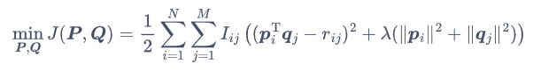
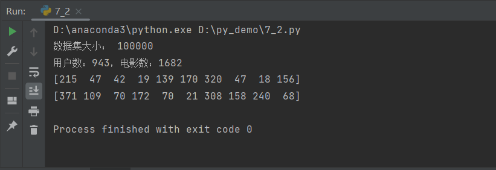
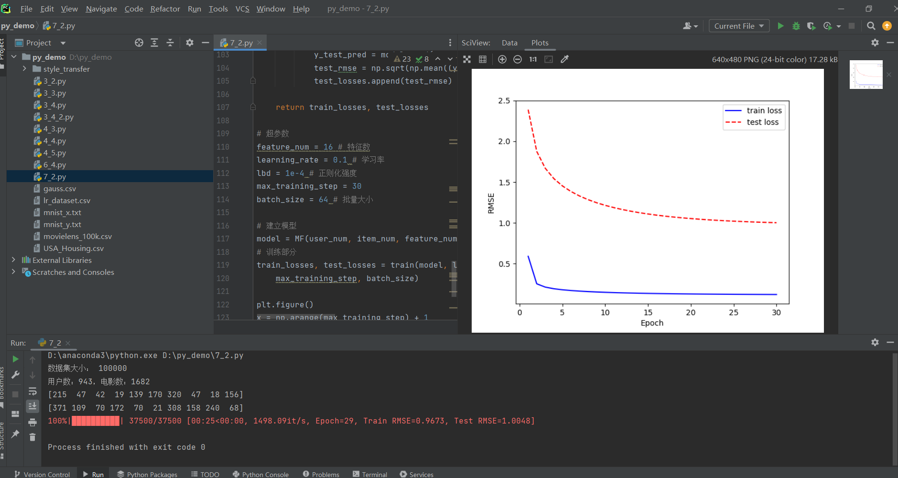
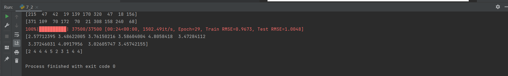
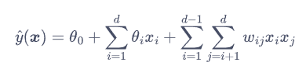
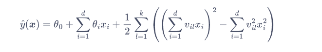
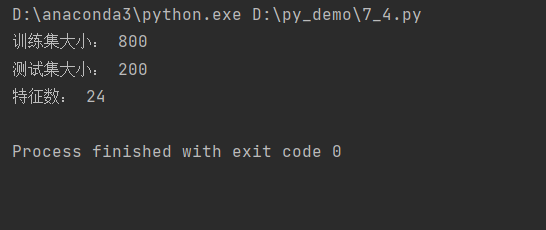
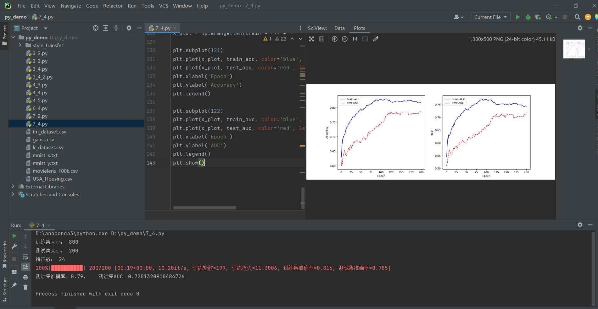

#  Bilinear Model
Date:2023-12-01
Version:1.3

双线性模型虽然名称中包含“线性模型”，但并不属于线性模型或广义线性模型，其正确的理解应当是“双线性”模型。与线性模型类似，双线性模型并非指模型整体具有双线性性质，而是指其包含双线性因子。该特性赋予模型拟合一些非线性数据模式的能力，从而得到更加精准预测性能。本次总结主要由矩阵分解、因子分解机，以及对应的实现过程组成。

##  Matrix Factorization
推荐系统中评分预测的常用模型为矩阵分解,它的任务是根据用户和商品的评分来预测用户对其他商品的评分。书中以用户对电影的评分为例进行详细说明。假设有N个用户和M部电影，其中每个用户都对一些电影打出了自己的评分，我们的目标是需要为用户从他没有看过的电影中，向他推荐几部他最有可能喜欢看的电影。由于用户一般只对很小一部分电影做了评价。因此，我们需要从用户已经做出的评价中推测用户为其他电影的打分，再将电影按推测的打分排序，从中选出最高的几部推荐给该用户。

我们从生活经验出发思考问题，如果某用户为一部电影打了高分，那么可以合理推测用户喜欢这部电影的某些特征，于是我们可以构建一个电影特征库和用户画像库，再将所有电影的特征构成矩阵。这样，我们可以把一个用户与电影交互的矩阵拆分成了用户、电影两个矩阵，并且这两个矩阵中包含了更多的信息。然后两个矩阵相乘还原出用户对电影的评分，预测用户对电影的评分。

通常我们获取的是打分的结果，但是R常常是疏散的，因此我们需要从R
有限的元素中推测出用户的喜好和电影的特征，我们就以还原结果和R中已知部分的差距作为损失函数，一般情况下，我们就选用最简单的 MSE 作为损失，再加入对喜好P和电影特征Q的正则化约束就得到总的优化目标：


##  Implement Matrix Factorization
书中实验的数据集包含从电影评价网站 MovieLens 中收集的真实用户对电影的打分信息。采用其包含来自 943 个用户对 1682 部电影的 10 万条样本的版本 MovieLens-100k。数据集一行由三个数表示，用户编号为i、电影编号为j、用户对电影的打分为rij，其中分数最高值为5分，最低分为一分。

我们首先对数据集进行预处理，处理结果如下图所示：

然后我们将矩阵分解模型定义为类，在其中实现梯度下降算法，并将参数都初始化为1，代码如下：
```
class MF:
    def __init__(self, N, M, d):
        # N是用户数量，M是电影数量，d是特征维度
        # 定义模型参数
        self.user_params = np.ones((N, d))
        self.item_params = np.ones((M, d))
    def pred(self, user_id, item_id):
        # 预测用户user_id对电影item_id的打分
        # 获得用户偏好和电影特征
        user_param = self.user_params[user_id]
        item_param = self.item_params[item_id]
        # 返回预测的评分
        rating_pred = np.sum(user_param * item_param, axis=1)
        return rating_pred
    def update(self, user_grad, item_grad, lr):
        # 根据参数的梯度更新参数
        self.user_params -= lr * user_grad
        self.item_params -= lr * item_grad
```
接着定义训练函数，以 SGD 算法对 MF 模型的参数进行优化。对于回归任务来说，我们仍然以 MSE 作为损失函数，RMSE 作为的评价指标。
最后，我们定义超参数，并实现 MF 模型的训练部分，并将损失随训练的变化曲线绘制出来。实验结果如下图：

同时，为了直观地展示模型效果，我们输出一些模型在测试集中的预测结果与真实结果进行对比。上面我们训练得到的模型在测试集上的 RMSE 大概是 1 左右，所以这里模型预测的评分与真实评分大致也差 1。


##  Factorization Machines
推荐系统中用户行为预估的另一个常用模型就是因子分解机，但是它的应用场景则与矩阵分解模型不同，后者的目标是从交互的结果中计算出用户和物品的特征，而前者恰恰相反，即望通过物品的特征和某个用户点击这些物品的历史记录，预测该用户点击其他物品的概率，即点击率。

关于点击率的问题我们可以归纳为二分类的问题，即点击和未点击，于是我们就可以逻辑回归模型来解决问题。但是逻辑回归相当于假设不同特征之间是独立的，但是现实情况往往不是如此，因此，作为对线性的逻辑斯谛回归模型的改进，我们进一步引入双线性部分，将输入的不同特征之间的联系也考虑进来。改进后的预测函数为：


同时，在用向量表示某一事物的离散特征时，一种常用的方法是独热编码，向量的每一维都对应特征的一种取值，样本所具有的特征所在的维度值为 1，其他维度为 0。然而，独热特征向量往往维度非常高，只有少数几个位置是1，其他位置都是0，稀疏程度很高，为了解决这个问题，Steffen Rendle 提出了因子分解机模型。用分解矩阵的方法来解决问题。虽然向量非常稀疏，FM 模型也可以正常进行训练，但是，我们所需要耗费的时间还是很多，，于是我们再次优化模型，改变计算顺序以降低时间复杂度。至此，FM 的预测公式为：


##   Implement Factorization Machines
此次实验的数据集包含了某个用户浏览过的商品的特征，以及用户是否点击过这个商品。数据集的每一行包含一个商品，前 24 列是其特征，最后一列是 0 或 1，分别表示用户没有或有点击该商品。我们的目标是根据输入特征预测用户在测试集上的行为，是一个二分类问题。

首先，我们先导入必要的模块和数据集并处理数据，将其划分为训练集和测试集。数据集大小如下：

接着，同MF模型，在类中实现预测和梯度更新方法。代码如下：
```
class FM:
    def __init__(self, feature_num, vector_dim):
        # vector_dim代表公式中的k，为向量v的维度
        self.theta0 = 0.0 # 常数项
        self.theta = np.zeros(feature_num) # 线性参数
        self.v = np.random.normal(size=(feature_num, vector_dim)) # 双线性参数
        self.eps = 1e-6 # 精度参数
    def _logistic(self, x):
        # 工具函数，用于将预测转化为概率
        return 1 / (1 + np.exp(-x))
    def pred(self, x):
        # 线性部分
        linear_term = self.theta0 + x @ self.theta
        # 双线性部分
        square_of_sum = np.square(x @ self.v)
        sum_of_square = np.square(x) @ np.square(self.v)
        # 最终预测
        y_pred = self._logistic(linear_term \
            + 0.5 * np.sum(square_of_sum - sum_of_square, axis=1))
        # 为了防止后续梯度过大，对预测值进行裁剪，将其限制在某一范围内
        y_pred = np.clip(y_pred, self.eps, 1 - self.eps)
        return y_pred
    def update(self, grad0, grad_theta, grad_v, lr):
        self.theta0 -= lr * grad0
        self.theta -= lr * grad_theta
        self.v -= lr * grad_v
```
我们仍用 MLE 作为训练时的损失函数。在测试集上，我们采用 AUC 作为评价指标。然后我们用 SGD 进行参数更新，训练完成后，我们把训练过程中的准确率和 AUC 绘制出来。结果如下：


##  Conclusion
双线性模型通过引入满足双线性性质的函数，相比于线性模型提升了对特征间关系建模的能力，从而达到更好的预测效果。MF和FM是推荐系统中常用的模型，区别是应用的场景不同。对于MF，用户和商品的特征都是未知的，我们需要从模型训练中获得，而对于FM，用户的特征是已知的，我们想知道特征与输出、特征与特征之间的关系。

这个两个模型都是现如今常用的模型，MF模型有着高效性、模型简单的特点。缺点是MF模型对于新用户和新物品的冷启动问题处理能力较弱，因为它需要足够的历史交互数据才能进行有效的推荐，还有MF模型通常只能处理显性反馈数据（如评分），对于隐性反馈数据（如点击、浏览等）的处理相对困难。而对于FM模型，模型拟合能力强、能够解决冷启动问题等是它的优势，但在计算复杂度、对缺失数据的处理困难等方面就略逊一筹。

综上所述，矩阵分解模型适用于处理显性反馈数据和大规模稀疏数据的场合，而因子分解机模型适用于处理高维稀疏数据、隐性反馈数据和冷启动问题的场合。根据具体的数据特点和需求，选择适当的模型可以提高推荐系统的性能和用户体验。
