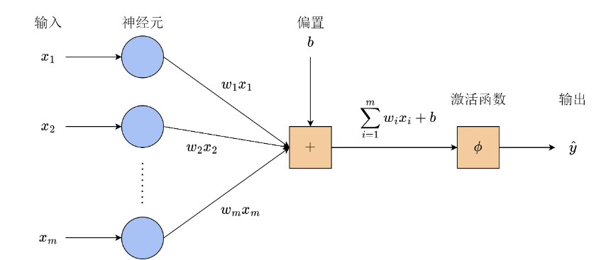

#  Neural Network  
Date:
Version:1.0
神经网络是机器学习中最重要的内容之一，也是机器学习的基础。神经网络的名称来源于生物中的神经元。自有计算机以来，人们就希望能让计算机具有和人类一样的智能，因此，许多研究者将目光放到了人类的大脑结构上。本次总结主要围绕人工神经网络、感知机、隐含层与多层感知机、反向传播以及多层感知机的相关实验而展开

##  Artificial Neural Network
由上所述，我们可以得知动物能够通过神经元建立智能，于是我们便猜想能不能通过模拟神经元的结构和行为方式，建立起人工智能？这个问题在1943由沃伦·麦卡洛克和沃尔特·皮茨开始着手研究，研究者们设计了人工神经网络。在最开始，人工神经网络完全模仿生物神经网络的方式。其中，每个神经元就是一个节点，神经元之间的连接就作为有向边。神经元发送的信号我们通过神经元发送的信号通过连接权重wji加权求和，得到内部信号总和zj，即：

同时，设计者在每个神经元中提前设计好阈值，用来模拟生物神经元的激励与抑制信号。当某个神经元收到外部输入时，就会对输入进行处理，通过计算输出信号，这样的行为方式与生物神经元非常相似，然而，其表达能力十分有限，能解决的问题也很少。此外，每个神经元上的参数还需要人为指定。因此，这时的神经网络还只是具有雏形。

##  Perceptron
人工神经网络面临最大的问题在于，需要人为的确定每条边的权重，当神经网络规模比较庞大时，我们很难确定合适的权重。为了简化问题，弗兰克·罗森布拉特提出了感知机的概念。他们从生物接受刺激、产生感知的过程出发，用神经网络抽象出了这一模型，输入经过神经元后被乘上权重并求和。但是，感知机还额外引入了偏置项，把它一起加到求和的结果上。最后，该结果再通过模型的激活函数，得到最终的输出。感知机的结构如下图：

感知机中有两个新奇的变化，首先是偏置，它相当于给线性变换加入了常数项。举一个一次函数的例子，加入偏置就相当于把一个过原点的一次函数变成了有截距的一次函数，通过图像我们很容易的就能知道，它就可以表示平面上的任意一条直线，模型的表达能力大大提高了。其次是激活函数，激活函数可以模拟神经元的兴奋和抑制状态。在感知机中，激活函数通常为示性函数，当输入为非负数时，函数输出值为1，即为兴奋状态；当输入为负数时，函数输出值为0，即为抑制状态。感知机模拟了神经元受到输入刺激后给出反应的过程，我们可以用此来解决二分类的问题。

感知机最大的突破是其参数可以参数可以自动调整，我们就无需人工一个一个调试，罗森布拉特利用生物中的负反馈调节机制来调整感知机的参数。对于该样本，感知机收到的反馈为，其参数根据反馈进行更新：

其中，η为学习率，如果感知机的预测正确，则其收到的反馈为0，参数不需要更新。如果感知机预测错误，那么感知机会根据错误情况适当调整偏置和权重。综上可以看出，以上已经有了梯度下降的思想。

然而感知机也存在着致命的缺陷，那就是感知机只能处理线性问题，对于亦或问题感知机却无法解决。这一事实被提出后，感知机的表达能力和应用场景遭到广泛质疑，神经网络的研究也陷入了寒冬。

##  Hidden layer and multi-layer perceptron
为了解决感知机只能处理先行问题的缺陷，有学者提出是否能通过增加网络的层数，即将一个感知机的输出作为输入，连接到下一个感知机上。如果一个感知机对应平面上的一条直线，那么多个感知机就可以将平面分隔成多边形区域，达到超越线性的效果。然而，如果将不同层之间的神经元随意连接，那么我们会得到多种解决同一个问题的结构，从而从而大大增加结构设计的难度。

因此，当我们组合多个单层的感知机时，我们通常将神经元分为不同的层，每一层只和其前后相邻层的神经元连接，层内以及间隔一层以上的神经元之间没有连接，这种结构就是前反馈结构。这样，我们可以将网络的结构分为直接接收输入的输入层、中间进行处理的隐含层）、以及最终给出结果的输出层。下图为两层的前馈网络示意图：

需要注意，前馈网络的层数是指权重的层数，即边的层数，而神经元上不携带权重。

将多个单层感知机按前馈结构组合起来，就形成了多层感知机。值得注意的是，激活函数一定得是非线性的，才能使网络模型有更广的拟合能力。目前，常用的激活函数有：

 -   逻辑斯谛函数：该函数又称 sigmoid 函数，在逻辑斯谛回归一章中已经介绍过，会将映射到区间内。直观上，可以将 0 对应生物神经元的静息状态，1 对应兴奋状态。相比于示性函数，逻辑斯谛函数更加平滑，并且易于求导。逻辑斯谛函数的推广形式是 softmax 函数，两者没有本质不同。
 - 双曲正切函数：与逻辑斯谛函数均为“S”形曲线，同样常用与分类任务。
 - 线性整流单元：该函数将小于 0 的输入都变成 0，而大于 0 的输入保持原样，虽然函数的两部分都是线性的，但在大于 0 的部分并不像示性函数一样是常数，因此存在梯度，并且保持了原始的输入信息。一些研究表明，ReLU 函数将大约一半的神经元输出设置为 0、即静息状态的做法，与生物神经元有相似之处。

在实践中，考虑到不同隐含层之间的对称性，我们一般让所有隐含层的激活函数相同。而 ReLU 函数作为计算最简单、又易于求导的选择，在绝大多数情况下都被用作隐含层的激活函数。输出层的激活函数与任务对输出的要求直接相关，需要根据不同的任务而具体选择。

从上面的分析我们也能看出，非线性部分对提升模型的表达能力十分重要。非线性部分相当于提升了数据的维度，原本在同一平面上的点经过这样的非线性变换，就分布到三维空间中去了。但如果变换为线性的，原本在同一平面上的点变换后在空间中仍然位于同一平面上，只不过是所处的平面做了平移、旋转。虽然看上去这些点也在三维空间，但本质上来说，数据间的相对位置关系并没有改变。数据维度提升的好处在于，在低维空间中线性不可分的数据，经过合适的非线性变换，在高维空间中可能变得线性可分。

##  Back Propagation
为了调整多层感知机的参数，训练神经网络，设最小化的目标函数为
J（x），我们依然需要计算目标函数对网络中各个参数的梯度。对于前馈网络来说，其每一层的计算是依次进行的。先给出反向传播的示意图：

按照上图的计算顺序，我们在最后一层计算出来的结果，可以直接用在倒数第二层的梯度计算上，以此类推。因此，每一层的梯度由两部分组成。一部分是当前的激活函数计算出的梯度，另一部分是后一层回传的梯度。像这样梯度由后向前传播的算法，就称为反向传播算法，该算法是现代神经网络训练的核心之一。从数学的角度来讲，反向传播算法成立的根本原因是链式求导法则，从而靠后的层计算得到的结果可以在靠前的层中反复使用，无须在每一层都从头计算，大大提高了梯度计算的效率。

##  Implement multi-layer perceptron
本次实验采用的数据集为亦或数据集，与上文描述的离散异或问题稍有不同，该数据集包含了平面上连续的点。坐标的标签为对应点的示性函数值。因此，当样本在第一、三象限时，其标签为 0；在第二、四象限时标签为 1。

导入数据集之后，我们开始实现MLP，因为MLP为前馈结构，我们可以将其拆分为许多层。每一层都应当具有根据输入计算输出，计算参数的梯度，更新层参数。激活函数可以抽象为单独的一层，不具有参数。但是为了形式统一，我们先定义了基类，再让不同的层继承基类。

线性层则是MLP 中最基本的结构之一，其参数为W和b，输入与输出关系为y = Wx + b。由于其结构相当于将前后的神经元两两都连接起来，因此又称为全连接层。

MLP中还有非线性激活函数，在此实验中只实现了逻辑斯谛函数、tanh 函数和 ReLU 函数 3 种激活函数。同时为了将其用到MLP中，我们还需知道上述三种函数的梯度。除此之外，我们有时希望激活函数不改变层的输出，因此我们再额外实现恒等函数。这些激活函数都没有具体的参数，因此在实现时`update`留空，只需要完成前向和反向传播即可。

最后，我们可以直接将封装好的 MLP 当作一个黑盒子使用，并用梯度下降法进行训练。在本例中，异或数据集属于二分类任务，因此我们采用交叉熵损失，结果如下图：

##  Conclusion
人工神经网络是深度学习的基础，而现代人工智能的大部分应用都涉及深度学习。可以说，现在一切实用的人工智能模型都包含了不同结构的神经网络。人工神经网络有许多优点，如学习能力强、适应性强、可以并行处理问题、可以处理非线性问题等等，这让人工神经网络广受大家喜爱。但是他也有他的缺点，比如，神经网络通常需要大量的标记数据来进行训练，这可能需要耗费大量的时间和资源；神经网络的性能很大程度上依赖于参数的选择和调整，这需要专业知识和经验；神经网络的工作原理比较复杂，难以解释其决策过程，这在一些应用场景下可能会受到限制。

人工神经网络在许多领域都具有广泛的应用，当我们想要解决关于模式识别与分类、预测和回归、数据挖掘和信息提取、自然语言处理、图像和信号处理问题时，人工神经网络可以胜任。总之，如果需要从大量数据中发现规律、进行分类、预测、自然语言处理、图像和信号处理等任务，那么使用人工神经网络方法是一个不错的选择。然而当我们遇到数据稀缺、对实时性要求高、数据质量差、或对实时性要求高的情况时，我们也许就不太适合用神经网络的方法了。在这种情况下，其他机器学习或统计方法可能更合适，或者需要结合多种算法方法来解决问题。

总体而言，人工神经网络具有强大的学习和处理能力，但也存在一些挑战和限制。在实际应用中，需要根据具体问题和资源条件来评估其适用性。

