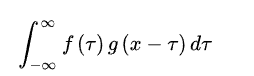
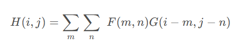
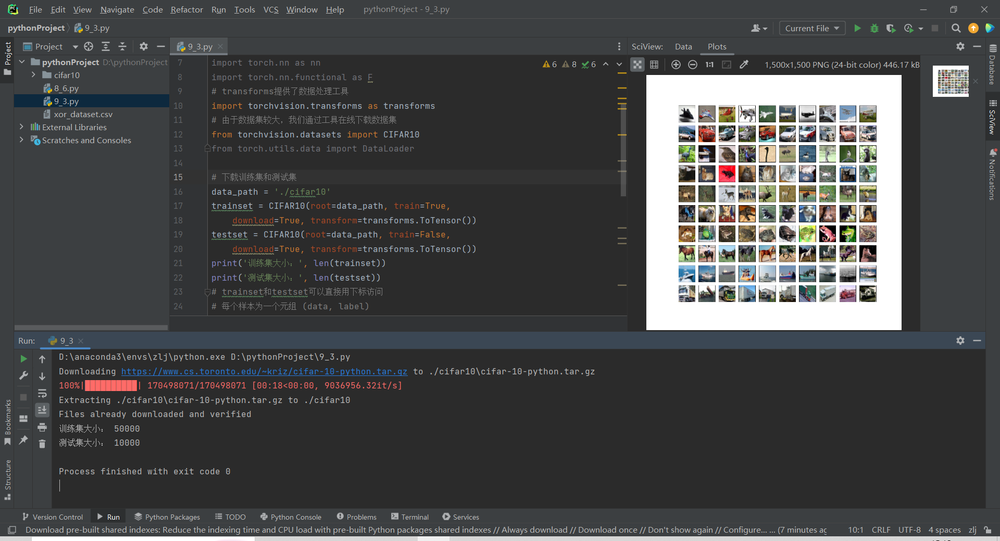
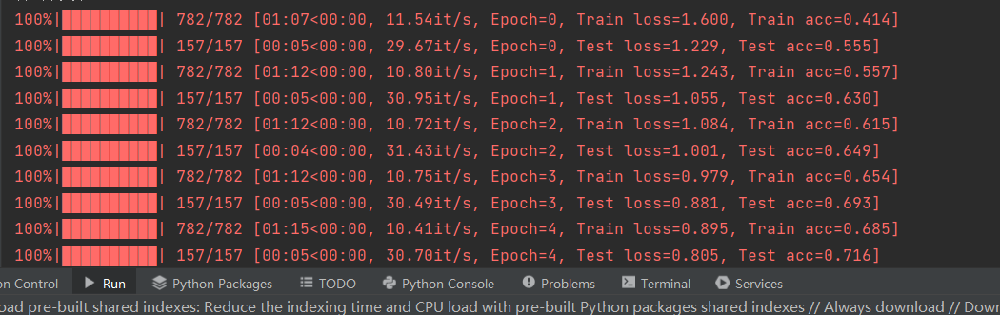
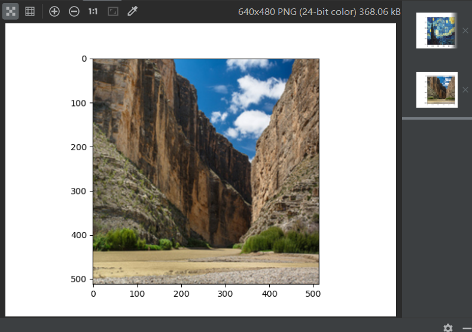

# CNN
Date:2023-12-15
Version:1.3

卷积神经网络（Convolutional Neural Network，CNN）是一种深度学习模型，它主要用于处理具有类似网格结构的数据，如图像、语音、文本等。CNN的核心思想是卷积操作，通过对输入数据进行一系列的卷积、汇聚和非线性变换操作，来实现对数据的特征提取和分类。

对于多层感知机模型，如果我们想要完成之前在KNN算法中实现的类似的图像处理任务，将图像作为输入，仅仅对其进行线性变换。虽然如果MLP的层数足够多，在理论上我们可以提取出二位特征，但是模型的复杂度和训练难度会大大增加。于是，我们希望有一种更适合提取高维特征的运算和网络结构，而CNN就是基于这个思路设计的。本文将会总结卷积运算的特点和作用，以及相应的搭建CNN完成相应的任务。

##  Convolution
首先，卷积是一种数学运算。简单定义：设:f(x),g(x)是R1上的两个可积函数，作积分：

单纯的观察这个公式我们也许很难理解，因此我们可以可以从其应用场景来理解其意义。卷积运算在信号处理中有广泛的应用，常常用于计算输入信号经过某个系统处理后得到的输出信号。接下来我们假设输入信号为g(x),系统函数为f(x)。我们可以将t理解为时间，故当信号函数输入到系统中时，由于应该是t较小的一方先被接收，故应该将g(x)水平翻转。接着随着时间的不断增加，信号函数不断与系统函数接近，直到与系统函数相交就代表系统接受到了信号。而对应时刻f(x)g(t-x)所围成的面积就是卷积的值。我们再重新审视卷积的定义公式，如果将f函数看作权重，那么卷积就是再求t时刻g函数按f函数加权的平均值。因此我们可以认为，卷积的本质是计算某种特殊的加权平均。

##  神经网络中的卷积
当我们遇到图像输入的任务的时候，我们常常会想到从图像入手，提取图像中对我们有帮助的特征，比如图像中不同物体的边界、物体间的相对位置等等。在学习了卷积之后，我们可以利用卷积的知识解决这一问题。我们可以对图像做卷积，把我们想要的特征提取出来。

我们首先将一维的卷积扩展到二维，这样我们就可以在图像上应用卷积。二维卷积公式为:

通过之前对一维卷积公式的分析我们可以知道，该公式是在计算以F(m,n)为权重的G(i-m,j-n)在空间上的加权平均。权重的不同就能代表图像上不同像素的重要程度。因此，我们可以通过适当的权重F将组成某一特征的像素全部提取出来。而在神经网络中我们可以设置f为训练的参数，并利用梯度反向传播的方法训练模型，自动的调整F。而像这样主要由卷积运算构成的神经网络就为卷积神经网络（CNN），在CNN中进行卷积运算的层为卷积层，权重F为卷积核。

在神经网络中，如果我们将F在计算的时候先翻转，最终得到的参数也只是在位置上翻转了，具体的数值没有发生变化，因此我们常常省略翻转操作而是直接运算，这也被称为互相关。然而在机器学习中，我们依然称其为卷积。我们在对卷积公式做了一些不影响后续结果的操作之后，我们可以得出卷积核F从G(0,0)开始滑动，对于m,n超出图像尺寸的情况下，我们直接假设G在该值处为0。故我们在计算时便无需遍历全部范围。

发现了一个有趣的事情，当我们把一个2 × 2的卷积核作用到3像素 × 3像素的图像上时，我们最终得到的结果的形式是2 × 2的矩阵，小于输入图像的尺寸。但有时候我们希望输出的图像能保持和输入图像同样的尺寸，这时我们会对输入图像的周围进行填充。通过填充我们就可以抵消卷积运算对图像尺寸的影响。图像填充的方式有全零填充、常数填充、边界扩展填充等等，我们可以根据面临的情况选择合适的方法。

通过上述，我们可以提出一个问题，卷积运算的提取特征的范围是由什么决定的呢？通过上面那个有趣的事情我们可以大胆的猜测是由卷积核决定的。答案也是如此，其提取的范围就是卷积核的尺寸，卷积核的尺寸又被称为感受野，来源于神经科学的概念。较小的卷积核可以提取局部特征，但是很难发现全局的物体之间的位置关系；而较大的卷积核可以发现整体的结构特征，但是对细节的捕捉能力较差。因此，在一个CNN中我们常常会使用多种尺寸的卷积核，还会使用多个相同尺寸的卷积核以分析问题。

此外，在图像中通常会有大量的相似像素，在这些区域上进行卷积得到的结果基本是接近的，故我们会得到大量的冗余信息。所以，在卷积之外，我们通常会对图像进行池化工作。池化即一种采样操作，常见的种类有平均池化和最大池化，就是用区域内的平均值获最大值来代表区域。通常，池化的窗口在滑动时不会重复，因此得到的输出图像会比输入图像显著缩小。

##  用神经网络完成图像分类任务
接下来我们要用PyTorch实现一个卷积神经网络，并用它完成图像分类任务。该任务要求模型能识别输入图像的主要物体的类别。本次采用的数据集包含了10个种类的图像，数据集中的所有图像都为32像素 × 32像素，色彩模式为RGB，共三个通道。训练集为50000，测试集大小为10000，其中每个类别都有6000幅图像。首先导入数据，结果如下图：

根据之前的总结，我们知道了基础的CNN主要由两部分组成——卷积和池化。我们依次的用卷积和池化提取图像中不同的特征，最终不同的特征经过全连接层，输出为一个10维向量。其中，每一维分别代表图像属于对应类别的概率。再多分类问题中，我们为了使输出的所有分类概率总和为1，我们通常会在输出层使用softmax激活函数。在通过激活函数的到每一类的概率之后，我们再凭借最大似然估计的思想，将MLE与softmax结合，得到多分类的交叉熵损失。CNN的发展历程当中诞生了许多非常有效的网络结构，其中AlexNet可以说使划时代的设计，我们这次使用的是其简化版本。该网络共有8层，其中前六层由卷积、卷积和池化组成，最后为全连接层。由于不同的卷积核表示的是图像上同一位置的不同特征，和图像的色彩通道含义类似，于是我们将卷积核的数量也称为通道。多个通道的输入，我们同样可以使用多通道卷积核计算。

除此之外，AlexNet引入了暂退法，暂退法会在每次前向传播的时候，按比例随机把输入中的神经元隐藏起来，使他们对后面的输出不产生影响，对模型来说这样可以降低模型的复杂度，缓解模型的过拟合问题。

最后我们设置超参数，利用梯度下降法进行训练，训练结果如下图：

##  用预训练的卷积神经网络完成色彩风格迁移
根据CNN的原理，我们在训练完成一个CNN后，其中间的卷积层可以提取不同类型的特征。网络的卷积和池化层将图像特征提取出来，全连接层则接受提取的特征作为输入，再根据具体的任务目标给出相应的输出。由此我们可以知道，CNN中的特征提取结构的参数可能并不依赖于具体任务。在一个任务上训练完成的卷积核可以迁移到别的任务上去，接下来我们会按照这一思路，以预训练好的网络为基础，完成图像的色彩风格迁移任务。

###  VGG网络
此次的预训练网络为VGG网络。VGG网络给出了一种CNN的结构设计范式，即通过反复堆叠基础的模块以构建网络。在VGG网络的结构中，网络中的基本模块称为VGG块，由数个边缘填充层数为1的卷积层和最大池化层组成。在一个VGG块中，卷积前后的图像的尺寸不变，但池化层会使图像的长和宽变为原来的一半。每个VGG块的输出通道都是输入通道的两倍，如此，随着输入尺寸的减小，网络提取的特征会不断增多。最后，网络再将所有的特征输入到全连接层当中，以得到最终的结果。

###  内容表示与风格表示
与之前KNN算法不同，这次我们可以直接利用训练好的VGG网络提取图像在不同尺度下的特征。我们可以利用梯度下降的思想，从一幅空白图像或者随机的图像中出发，用VGG提取其风格特征和内容特征，在和目标的内容图像或风格图像相应的特征进行比较和计算损失，之后再通过梯度的反向传播来更新输入图像的内容。这样，我们就可以得到在内容上与内容图像相近，但在风格上与风格图像相近的结果了。

对于CNN，随着层数的增加，网络提取的特征会会越来越侧重于图像整体的风格以及有关图像中物体相对位置的信心。浅层的卷积核基本只输出原图的像素信息，但是深层的卷积核可以输出图像整体的一些抽象结构特征。

接下来我们用PyTorch来完成风格迁移任务。首先导入库，并读取数据集，加载图片如下：

接下来我们定义内容损失和风格损失模块。之后我们下载已经训练好的VGG16网络，按照其结构抽取计划的的卷积层，并舍弃与原始任务高度相关的全连接层，但是将激活函数和池化层保持原样。我们将抽出的层依次加入一个新创建的模型当中，以供后续提取特征使用。最后，我们设置超参数，并训练模型，查看图像生成的效果。

##  Conclusion
本次总结主要介绍了卷积神经网络和其在图像上的应用，CNN在图像任务上的出色表现逐渐让人工智能走进了大众的视野。除了图像之外，CNN捕捉不同尺度特征的能力在自然语言处理中也有广泛的应用，我们可以用它来提取文本中上下文的背景内容，从而让模型对文本有更准确的了解。但我们同样也需要克服CNN对数据量要求较高、对计算资源要求较高等缺点。

另外，将训练好的CNN中我们需要的层提取出来用于新任务的做法，可以避免从零训练网络产生的大量时间和资源的开销。在深度学习时代，随着模型复杂度不断的增大，像这样的预训练模型得做法越来越广泛，而且对于如何更好的利用其完成特定的任务，已经成为了深度学习领域重要的研究课题之一。

