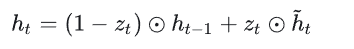

#  Recurrent Neural Network
Date:2023-12-22
Version:2.1

循环神经网络是一种基于神经网络的模型，它可以处理序列数据。与传统的神经网络结构不同，循环神经网络在网络中引入了一个循环的概念，使得网络可以保留之前输入的信息，并将其作为当前时刻的输入。

在循环神经网络中，每个节点接收到来自上一时刻的输出和当前时刻的输入，并通过内部的状态，将信息传递到下一时刻。这种机制可以使得网络能够对序列数据进行建模，例如语音、文本或时间序列数据等。因此，循环神经网络在自然语言处理、语音识别、时间序列预测等领域有着广泛的应用。

本文主要围绕RNN基本原理、门控循环单元以及相关实验进行分析总结。

##  基本原理
我们可以从最简单的模型开始入手，对于不存在序列关系的数据，我们通常采用两层的MLP来拟合。设输入样本为x，经过第一个隐含层得到其中间变量，再经过一个隐含层得到输出结果，这是一个标准的MLP的预测流程。

我们假设数据集中的数据是在时刻1和时刻2采集到的，而且我们知道时刻2的结果和时刻1有关。所以，如果我们用相同的模型权重来进行预测，那么预测的准确率就会降低。为了在模型中利用其关联信息，于是我们拓展了MLP的结构。我们在计算时刻2的中间变量时，将时刻1的中间变量也纳入进来，得到时刻2的中间变量，再将其传给第二个隐含层。以此类推，我们将MLP沿着序列不断扩展下去，中间的每个MLP都将前一时刻的中间变量与当前的输入组合得到的中间变量，在进行后续处理。并且序列中每一个位置存在对称性，故每一MLP前后的权重与中间组合的权重可以共用，不随序列位置变化，因此这样重复的网络结构称为循环神经网络。结构如下图：

RNN其实并不需要在每一个时刻都有一个输入样本和一个预测输出。根据任务的不同，RNN的输入输出有多种形式。例如：一对多、多对一、同步多对多、异步多对多，而且他们都有各自适用的任务场景。

如果在t时刻存在输出，我们可以计算时刻t的损失函数，并使用梯度回传的方法优化参数。但是随着反向传播的步数的增加。RNN有可能会出现梯度消失或梯度爆炸的现象。无论出现以上哪种情况，网络的参数都无法正常更新，模型的性能也会大幅度降低。当出现梯度消失时，距离时刻t较远的信息已经丢失，模型很难捕捉到序列中的长期关联。而当出现梯度爆炸时，参数的变化幅度过大，模型训练非常不稳定，甚至可能不收敛。

解决上述现象最简单的做法就是对梯度进行裁剪，为梯度设置上限和下限，当梯度过大或过小的时候，我们直接用上下限来代替梯度的值。然而这种做法在复杂情况下作用很小，我们通常用其作为一种辅助手段。我们还可以将网络中关联起相邻两步的参数扩展成一个小的网络，通过设计其结构来达到稳定梯度的目的。

##  GRU
为了解决梯度消失与梯度爆炸的问题，GRU对普通的RNN的设计进行改进，通过门控单元来调整ht和ht-1的关系。在这里我们将输入xt理解为外部输入的信息， ht为网络记住的信息，它从时刻1开始向后传递。然而我们并不需要将所有时刻都保存下来，因此必须要有选择的遗忘。下图为GRU的结构：

GRU设置的门控单元有两个，分别为更新门和重置门。每个门控单元输出一个数值或向量，由前一个时刻的信息和当前时刻的输入组合计算得到。其中，zt是更新单元，rt是充值单元，σ是逻辑斯蒂函数。这两个单元的计算方式相同，但是他们发挥的作用是不相同的，我们利用重置单元对过去的信息进行选择行遗忘。当rt某一个维度的值接近于0时，网络就更倾向于遗忘ht-1的相应维度；反之接近于1时，网络则更倾向于保留。之后我们再将结果与xt组合。最后我们再决定ht是倾向于旧的信息ht-1，还是倾向于旧信息与新输入的混合。我们令：

在上式中，如果更新单元zt接近1，我们将保留更多的旧信息ht-1，而忽略xt的影响；反之，如果zt接近0，我们将让旧信息与新信息混合。在GRU中我们可以调整门控单元的值，使该梯度保持稳定，这样我们就可以解决梯度爆炸或者梯度消失的问题了。

##  实现GRU
在本次实验中，我们要完成一个时间序列预测任务。时间序列预测任务是指根据一段连续时间内采集的数据，分析其变化规律，预测接下来数据走向的任务。在本次实验中，我们生成了一条经过一定处理的正弦曲线作为数据集。该曲线包含1000个数据点，我们划分训练集800个，测试集200个。

首先我门先导入必要的库和数据集，并将数据集的图像绘制出来，结果见下图：

在下面的实验中，我们每次输入时间序列预测输入向后一步的数据。我还在GRU之后拼接一个全连接层，通过中间变量序列来预测未来数据的分布。

因为GRU的模型结构比较复杂，于是我们直接用PyTorch库中封装好的GRU模型，我们只需要为其提供两个参数。我们将out作为后全连接层的输入，得到预测值，再把预测值和hidden返回。hidden将作为下一次前向传播的初始中间变量。

之后我们设置超参数并实例化GRU。GRU在测试时，我们将输入的时间序列长度降为1，让GRU预测t+1的值。再将GRU自己预测的值作为输入，在预测t+2的值，循环往复。

我们再用一个3层的MLP模型作为对比。最后，我们在测试集上对比GRU和MLP模型的效果并绘制出来。图中包含了原始数据的训练集和测试集曲线，可以得出，GRU的预测基本符合测试集的变化规律，但MLP很快就偏离了测试集。结果见下图：

##  Conclusion
循环神经网络是一种具有记忆性能的神经网络结构。它在处理序列数据时表现出色，例如语音信号处理、自然语言处理等领域。它具有记忆性能、可以处理变长输入、可以共享权值。但是，梯度消失和梯度爆炸是其最大的弱点。由于存在梯度消失或梯度爆炸问题，RNN的训练过程较为困难，需要采用一些特殊的训练方法，例如LSTM、GRU等。

RNN凭借其直观的思想和强大的序列数据建模能力，始终占有一席之地。特别是在在需要考虑序列信息和时间依赖关系的任务，尤其在处理自然语言和时序数据方面表现出色。
